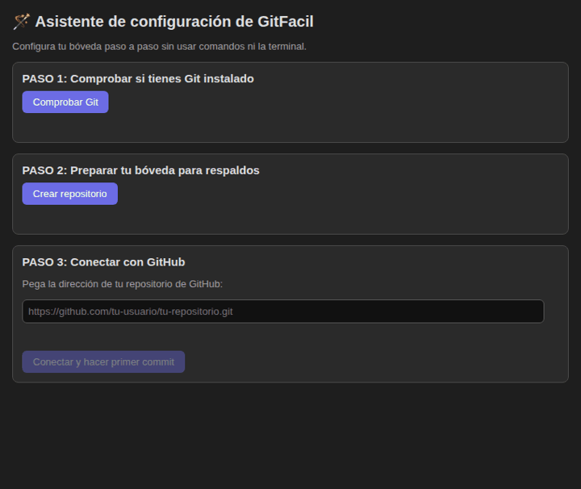
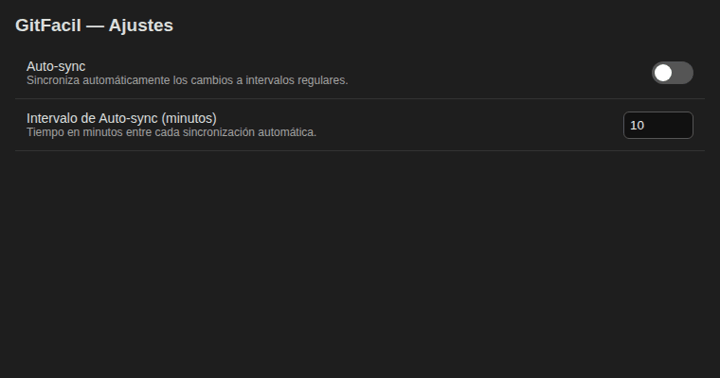

# GitFacil — Manual completo / Full manual

> **GitFacil** respalda y sincroniza tus notas de Obsidian con Git en un clic, sin terminal.
> **GitFacil** backs up and syncs your Obsidian notes with Git in one click, no terminal needed.
>
> Las imágenes son ilustraciones de la interfaz real.
> Images are illustrations of the real interface.

## ⚡ Encuentra todo rápido / Find everything fast

Todo GitFacil vive en la **paleta de comandos**: pulsa **`Ctrl+P`** (o `Cmd+P` en Mac) y escribe **GitFacil**. Verás:

| Comando / Command | Qué hace / What it does |
|---|---|
| GitFacil: Commit y Push | Sube todo ahora mismo |
| GitFacil: Abrir panel de Estado de Git | Abre el panel lateral |
| GitFacil: Abrir asistente de configuración | Abre el 🪄 asistente (paso 2) |

Además: icono **🚀** en la cinta izquierda (commit+push) e icono de estado (panel).

---

## 1. Instalación / Installation

**Desde el directorio (recomendado / recommended):** Ajustes → Community plugins → buscar **GitFacil** → Install → Enable.

**Con BRAT:** instala BRAT, Add Beta plugin → `https://github.com/Alecwce/obsidian-git-facil`.

**Manual:** descarga `main.js`, `manifest.json` y `styles.css` del último [Release](https://github.com/Alecwce/obsidian-git-facil/releases) y cópialos en tu bóveda en `.obsidian/plugins/git-facil/`.

Requisito: tener [Git](https://git-scm.com) instalado.

## 2. Asistente de configuración / Setup wizard (3 pasos)

**Cómo abrirlo:** `Ctrl+P` → **GitFacil: Abrir asistente de configuración** (también desde los ajustes del plugin, botón 🪄):

1. **Comprobar Git:** verifica que Git esté instalado y muestra su versión.
2. **Crear repositorio:** convierte tu bóveda en repositorio Git (`init -b main`). Si ya lo es, lo detecta y no hace nada.
3. **Conectar con GitHub:** pega la URL de tu repo (`https://github.com/usuario/repo.git` o `git@github.com:usuario/repo.git`) y pulsa **Conectar y hacer primer commit**. La URL se valida en vivo: el botón solo se activa con una URL válida.

> 🔐 Todo lo que Git rastree en tu bóveda se subirá al remoto: usa un repositorio **privado** si tus notas no deben ser públicas.

Antes de conectar, el asistente hace un **preflight**: verifica tu identidad Git (`user.name` / `user.email`, con el comando exacto si falta algo) y comprueba el acceso al remoto sin tocar tu configuración. El botón se activa solo cuando todo está en verde.

### Crear el repositorio desde el asistente (con `gh`)

Si tienes [GitHub CLI (`gh`)](https://cli.github.com) instalado y con sesión (`gh auth login`), el paso 3 te ofrece **crear el repo directamente**: escribe el nombre (por defecto, el de tu bóveda), deja marcado **Privado** y pulsa crear. Usa tu propio `gh`, sin guardar nada.

### Token manual (sin `gh`)

Si no tienes `gh`, el paso 3 tiene una caja de **token**: pégalo (campo password), pulsa **Verificar y guardar**. Se comprueba contra `api.github.com` y se guarda en la carpeta del plugin **en texto plano**: crea un token con el scope `repo` mínimo y revócalo si lo expones. Puedes borrarlo cuando quieras desde el mismo sitio.

## 3. Uso diario / Daily use

- **Icono 🚀 (cinta izquierda):** commit + push de todo con un clic. El mensaje usa tu plantilla.
- **Icono de estado (git-compare):** abre el panel lateral.
- **Paleta de comandos (`Ctrl+P`):** `GitFacil: Commit y Push`, `Abrir panel de Estado de Git`, `Abrir asistente de configuración`.

## 4. Panel de estado / Status panel

- La cabecera muestra la rama y su posición frente al remoto: `main ↑2 ↓1` (2 commits por subir, 1 por bajar). Sin remoto configurado verás `main (sin remoto)`.
- Marca con ✅ los archivos a subir (por defecto van todos), pulsa **🚀 Commit y push de lo marcado**.
- **⬇️ Bajar cambios (Pull):** trae lo nuevo del remoto.
- **🔄 Actualizar lista:** relee el estado de Git.

### Si el push es rechazado (anti-pánico)

Cuando el remoto tiene cambios que tú no tienes, Git rechaza el push. En vez de un error críptico verás un aviso con **🔄 Sincronizar con GitHub**: hace `fetch + pull --rebase + push` por ti. Si tenías cambios sin guardar, primero los protege en un stash y los restaura después. Si hay un conflicto real, aborta sin romper nada y te lo dice.

## 5. Auto-sync / Auto-sync

En ajustes activa **Auto-sync** y el intervalo en minutos: el plugin sube tus cambios solo, en segundo plano. Si una sincronización ya está en curso, la siguiente se salta sin duplicar commits.

Aunque no tengas cambios locales, cada ronda comprueba el remoto y **baja lo nuevo** si lo hay (sync de verdad, no solo backup).

## 6. Ajustes / Settings

| Ajuste / Setting | Qué hace / What it does |
|---|---|
| Idioma / Language | Español, English o idioma del sistema |
| Plantilla del mensaje de commit | Usa `{fecha}` para fecha y hora, ej. `📝 notas {fecha}` |
| Auto-sync | Copias automáticas cada N minutos |
| Intervalo de Auto-sync | Minutos entre copias (mínimo 1) |
| Ruta personalizada de Git | Solo si Git no se detecta solo, ej. `/usr/bin/git` |

## 7. Problemas / Troubleshooting

| Aviso | Causa | Solución |
|---|---|---|
| ❌ No se encontró Git | Git no está en el PATH | Instálalo o pon su ruta en ajustes |
| ❌ Tu bóveda no es un repositorio Git | Falta `git init` | Usa el asistente, paso 2 |
| ❌ No hay remote | Falta `git remote add origin` | Usa el asistente, paso 3 |
| ❌ Push rechazado | Cambios remotos pendientes | Pulsa Sincronizar con GitHub |
| ⏳ Ya hay una sincronización en curso | Un push anterior sigue corriendo | Espera a que termine |

## 8. Preguntas / FAQ

- **¿Mis notas salen de mi máquina?** Solo hacia tu propio repositorio Git (GitHub o el que configures). El plugin no envía nada a terceros.
- **🔐 ¿Mis notas serán públicas?** Depende de tu repositorio: todo lo que Git rastree en tu bóveda se sube al remoto. Usa un repositorio **privado** si tus notas no deben ser públicas, y revisa con `git status` qué se rastrea antes del primer push.
- **¿Funciona en móvil?** No, es solo escritorio (`isDesktopOnly`): necesita Git instalado en el sistema.
- **¿Qué pasa si edito mientras sincroniza?** Nada malo: el auto-sync se salta esa ronda y la siguiente lo sube.
- **🔍 Encuentra todo con `Ctrl+P`:** escribe GitFacil para ver los 3 comandos (commit, panel, asistente). Es la forma más rápida de usar el plugin.
- **¿Dónde reporto errores?** En [Issues](https://github.com/Alecwce/obsidian-git-facil/issues) con la versión del plugin, de Obsidian y tu sistema.
