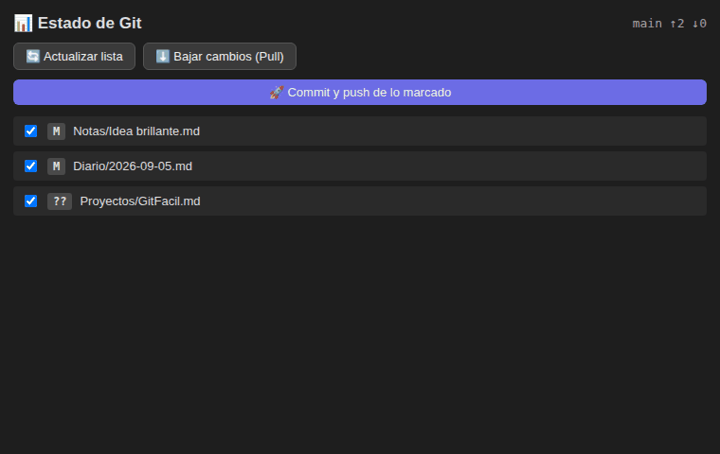

# GitFacil - Obsidian Plugin

**GitFacil** is an ultra-lightweight and simple Git backup plugin for Obsidian. / **GitFacil** es un plugin ultraliviano y sencillo para Obsidian que te permite respaldar y sincronizar tus notas con Git en un solo clic, sin complicaciones ni configuraciones complejas.

📖 **Manual completo / Full manual:** [MANUAL.md](MANUAL.md).

## Why GitFacil? / ¿Por qué GitFacil?

| GitFacil                         | Git CLI |
| -------------------------------- | ------- |
| One-click backup                 | ✅ |
| Setup wizard, no terminal needed  | ✅ |
| Status panel with file selection | ✅ |
| Auto backup every N minutes      | ✅ |
| Advanced Git operations          | ❌ |
| Mobile support                   | ❌ |
| Real-time sync                   | ❌ |

**Limitations:** desktop only (needs system Git), no diff viewer, no history browser, no conflict editor — on push conflicts use the guided sync button.

---

## 📋 Prerequisites / Requisitos

1. **Git installed / Tener Git instalado:** Download from [git-scm.com](https://git-scm.com).
2. **Git repository initialized / Repositorio inicializado:** Run `git init` in your vault root folder.
3. **Remote repository configured / Repositorio remoto:** Connect your vault to GitHub with `git remote add origin` using your repository URL — or skip the terminal entirely with the Setup Wizard below.

---

## Installation / Instalación

### Option 1: Community Plugin Directory (Recommended)
1. Open Obsidian **Settings** -> **Community plugins**.
2. Search for **GitFacil** and click **Install**.
3. Enable the plugin.

### Option 2: Via BRAT (Beta Tester)
1. Install **Obsidian BRAT** from community plugins.
2. Open BRAT settings -> **Add Beta plugin**.
3. Enter `https://github.com/Alecwce/obsidian-git-facil`.
4. Click **Add Plugin** and enable **GitFacil**.

### Option 3: Manual Installation
1. Download `main.js`, `manifest.json`, and `styles.css` from [Releases](https://github.com/Alecwce/obsidian-git-facil/releases).
2. Inside your vault folder, create the folder `.obsidian/plugins/git-facil/`.
3. Copy the downloaded files into that folder and reload plugins.

---

## Usage / Modo de Uso

- **🚀 One-click Ribbon Icon:** Click the rocket icon 🚀 in the left ribbon to commit and push changes immediately.
- **📊 Git Status Side Panel:** Open the side panel (icon `git-compare`) to view modified files, select checkboxes, pull changes, or commit selected files.
- **🪄 Setup Wizard:** Click `🪄 Configurar mi bóveda` in plugin settings for a 3-step zero-terminal guided setup.
- **🔄 Auto-sync:** Enable Auto-sync in settings to backup your vault automatically every N minutes.
- **Command Palette:** Search `GitFacil: Commit y Push` using `Ctrl+P` / `Cmd+P`.

---

## Settings / Ajustes

- **Commit Message Template / Plantilla:** Custom message template; the plugin automatically inserts the current date and time (a default message looks like: 📝 notas 2026-08-04 17:45).
- **Auto-sync Toggle & Interval:** Enable automatic background backups every N minutes.

---

## Network use / Uso de red

GitFacil runs `git` (and optionally your own `gh` CLI) locally. It calls `api.github.com` **only** when you verify a manual token in the setup wizard, and `gh` talks to GitHub only when you create a repository from the wizard. There is no telemetry and no GitFacil server.

---

## Troubleshooting / Solución de Problemas

| Error Notice | Cause / Causa | Solution / Solución |
| :--- | :--- | :--- |
| `❌ No se encontró Git` | Git not found in PATH | Install Git from [git-scm.com](https://git-scm.com) |
| `❌ Tu bóveda no es un repositorio Git` | Vault not initialized | Run `git init` or use Setup Wizard |
| `❌ No hay remote` | No remote repository | Connect it with the Setup Wizard or run `git remote add origin` with your repository URL |

---

## License

[MIT License](LICENSE) - Created by Alex Lazo.
